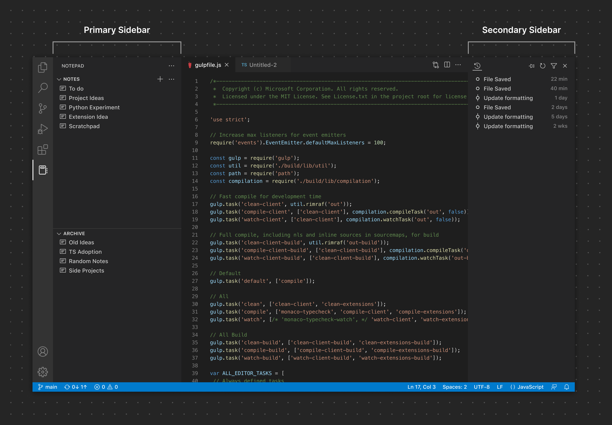

# REACT SIDEBAR VS CODE EXT.

The main pupropose of this documentation is to explain how this boilerplate is built and how to use it.

# VS Code extension development 

## Setup

To start VS Code extension development, you can refer to [this article](https://code.visualstudio.com/api/get-started/your-first-extension)

To start a VS Code extension we need the VS Code yeoman generator

```
npm install --global yo generator-code 
# or npx --package yo --package generator-code -- yo code
```

Then generate the extension

```
yo code
```

During the generation we kept basic options except for the extension type:

> [!IMPORTANT]  
> We generated the extension as a classic VS Code Typescript extension. Even if we want to use it in web environments (like VS Code for the web or Eclipse CHE, etc... ), we had some limitations with [VS Code Web extensions](https://code.visualstudio.com/api/extension-guides/web-extensions#web-extension-enablement) (like opening a terminal and execute a command on it).
It's maybe better to create a classic extension, then make it compatible for the web environnments.

For instance with the same or another web entrypoint in package.json

```
"main": "./dist/ext/extension.js",
"browser": "./dist/web/extension.js",
```

And env checking: 

```
const isWebEnvironment = vscode.env.uiKind === vscode.UIKind.Web;

if (isWebEnvironment) {
  // Code specific to web environment
  vscode.window.showInformationMessage('Running in a web environment');
} else {
  // Code specific to desktop environment
  const terminal = vscode.window.createTerminal('My Terminal');
  terminal.sendText('echo Hello World');
  terminal.show();
}
```

## Understand UX basics

To develop UX features on a VS Code extension you need to know corresponding [UX guidelines basics](https://code.visualstudio.com/api/ux-guidelines/overview) (at least to use identify the differents parts in the VS Code interface and how to name them).  

For now (2024) the VS Code UX consists of differents containers like this:


For this extension, we want to display a sepecific webview in a sidebar (see webview details below).
By default the webview can be displayed in the primary sidebar, then moved by the user to the secondary sidebar
You can see all the details here on [VS Code sidebars documentation](https://code.visualstudio.com/api/ux-guidelines/sidebars) 




In this webview we want to display a react app.

# REACT app in vscode sidebars

In order to handle more rich features in our extension sidebar, we choosed a webview display, with an embedded react app in it.

## Concept details  

We choosed to create the REACT app with the usual CRA CLI, as a specific npm workspace in our root folder.

This way we can also develop our react app with its own lifecycle, so we can do usual things with tools like live reload, web debugging... We can even imagine that the app or some components can work independantly outside vscode. Moreover, after some attempts, it felt less tricky than creating and compiling REACT components directly in our extension source code.

With this approach we had 2 possibilities to embed the react app in our extension webview :
- build with CRA and copy output files to our extension folder (or build output folder) with a script or any command
- build everything with webpack (so it can handle everything)

We choosed to use webpack to handle everything (moreover vs code extensions already use webpack)

## Setup REACT with CRA 

Declare the workspace:

```
  "workspaces": [
    "src/web",      // VS Code extension
    "src/webview"   // React app
  ],
```

Generate react app in src/webview subfolder:

```
npx create-react-app src/webview --template typescript
```

Eventually add some commands to package.json

```
"scripts": {
    "build": "npm run build:extension && npm run build:webview",
    "build:extension": "webpack --config webpack.config.js",
    "build:webview": "npm run --workspace=src/webview build",
    "start:webview": "npm run --workspace=src/webview start"
  }
```

## REACT app compilation (for VS Code webview)

We need to compile the react app to use it in our webview (with output files). As we said before, we choosed to use webpack to compile everything.

You must understand some webpack basics to be confortable with that. See the [documentation](https://webpack.js.org/guides/getting-started/).


Compiling web or REACT apps with Webpack can be specific (by using appropriate loaders...) 


# Ressources

We use those ressources to get some inspiration and start this project

- https://github.com/HuyQLuong/vscode-webview-extension-with-react/tree/main [from this article](https://medium.com/@luongquochuy1995/create-a-vs-code-left-panel-web-view-extension-using-react-e765fd901f64) 
- https://github.com/oslabs-beta/ReacTree [from this article](https://medium.com/@michaelbenliyan/developers-guide-to-building-vscode-webview-panel-with-react-and-messages-797981f34013)


# TODO

What features we need to make this project better?

- Hot Reload for extension ? (not a problem as we can build and run the webview with CRA, then test it in VSCode) [example here](https://blog.hediet.de/post/hot_reload_for_vs_code_extension_development) 
- optimize webpack build (env mode for react part, sourcemaps / tsloader opti according to env mode)
- add a sidebar toolbar (sidebar buttons) to allow user to switch between primary and secondary sidebar ?  [for now user has to do it manually](https://code.visualstudio.com/docs/editor/custom-layout) 
